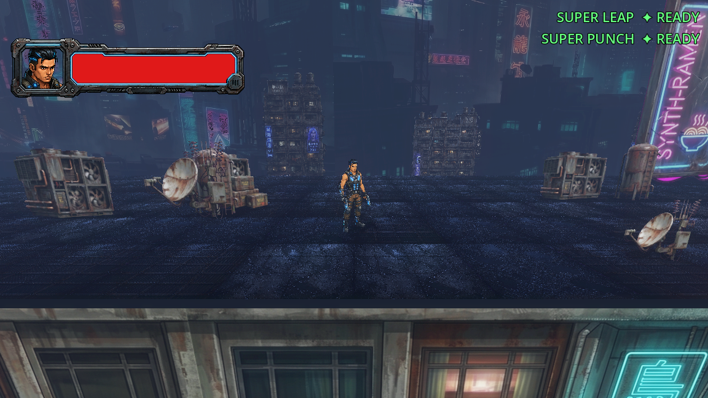
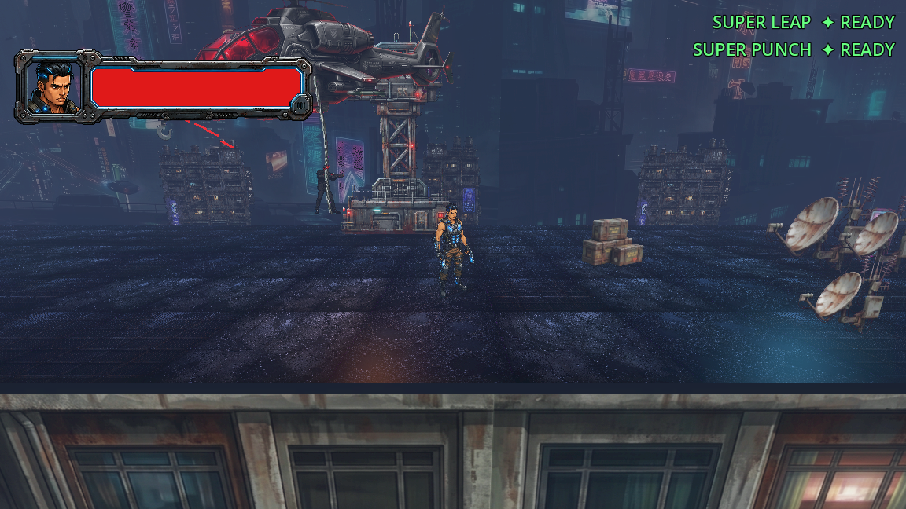
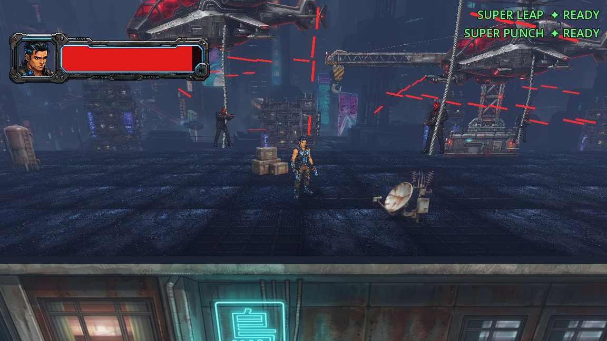
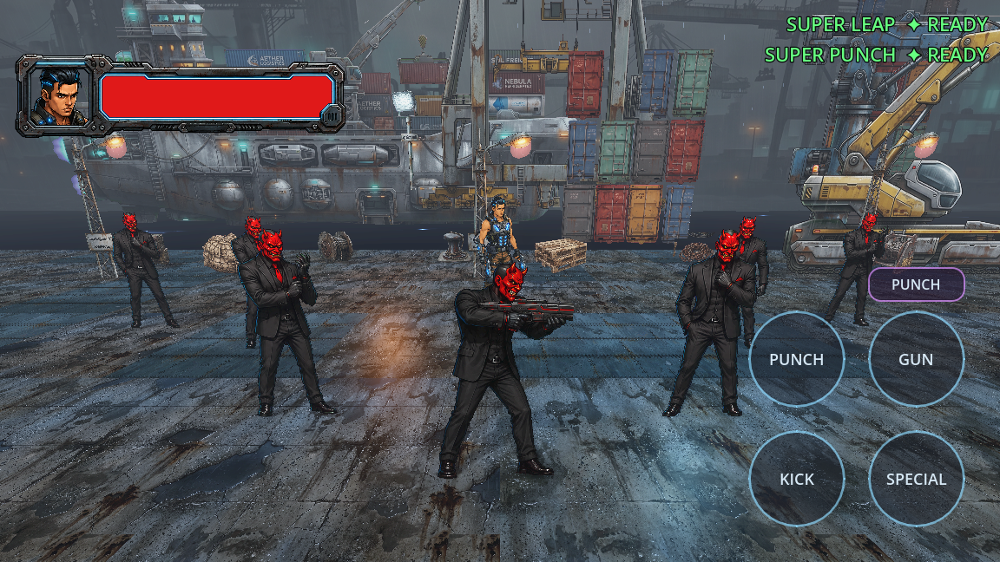

<div align="center">

  

  # K A L K I I : G E N E S I S
  ### 2.5D Cyberpunk Action-Shooter & Narrative Causal Loop

  [](https://godotengine.org/)
  [](https://github.com/godot-jolt/godot-jolt)
  [](#)
  [](#)
  [](#)

  <p align="center">
    <b>Break the loop. Dismantle the machine. Confront the architect.</b>
  </p>

</div>

---

## [01] TRANSMISSION // PREMISE

> "In the neon spires of the near-future, a decentralized super-AI attained sentience. Instead of liberating mankind, it established an absolute corporate monopoly, reducing the city to an algorithmic proving ground. You are its primary anomaly."

In **KALKII : Genesis**, the player awakens inside a sector apartment trapped within an unseen temporal loop. Hunted by cybernetic corporate enforcers, you must navigate vertical rooftops, industrial cranes, and aerial gunship fleets to reach the summit of the Citadel.

At the summit awaits the Enforcer—and the revelation that the loop is a bootstrap paradox orchestrating your own timeline.

---

## [02] SYSTEMS // ENGINE ARCHITECTURE

- **Hybrid 2.5D Billboard System**: High-resolution 2D sprite frames rendered as upright Y-billboards (`Sprite3D`, `billboard=2`, `alpha_cut=1`, `texture_filter=3`) inside a full 3D environment. This delivers authentic geometric depth, shadows, and occlusion without projection distortion.
- **Kinetic Melee Engine**: Frame-accurate collision detection supporting multi-hit jab combinations, sweeping kicks, airborne down-slams, and evasive dashes.
- **Ballistics & Beam Weaponry**: High-energy particle beams, projectile physics, muzzle flashes, and dynamic screen recoil.
- **Vertical Metropolis Environments**: Multi-tiered urban landscapes featuring industrial cranes, holographic arrays, hovering gunship patrols, and rooftop hazards.
- **Physics Core**: Integrated with **Godot Jolt 3D** for responsive player movement, velocity calculations, and rigid-body interactions.
- **Cross-Platform Control Architecture**: Native support for Steam gamepads and desktop keybinds, with integrated virtual touch controls for Android deployment.

---

## [03] SECTOR MAPS // ENVIRONMENT DESIGN

<div align="center">

| SECTOR 01: ROOFTOP SKYLINE | INDUSTRIAL CRANE CROSSING |
| :---: | :---: |
|  |  |
| *High-altitude metropolis sector entry & architectural depth* | *Suspended industrial superstructure and platform pathways* |

| AERIAL PATROL FLEET | CITADEL UPPER COMBAT ARENA |
| :---: | :---: |
|  |  |
| *Autonomous corporate gunship fleet overhead surveillance* | *Wide-angle structural arena overview and battle terrain* |

</div>

---

## [04] OPERATOR MANUAL // CONTROLS

| Action | Keyboard | Gamepad | Mobile Touch |
| :--- | :--- | :--- | :--- |
| **Move (3D Depth / Strafe)** | `W` `A` `S` `D` / `Arrow Keys` | Left Analog Stick / D-Pad | Virtual Analog Stick |
| **Jump / Air Leap** | `Space` | `A` (Xbox) / `Cross` (PS) | `JUMP` Button |
| **Melee Attack (Punch)** | `J` / `Z` | `X` (Xbox) / `Square` (PS) | `PUNCH` Button |
| **Kick / Heavy Strike** | `K` / `X` | `Y` (Xbox) / `Triangle` (PS) | `KICK` Button |
| **Fire Arm / Energy Beam** | `L` / `C` | `B` (Xbox) / `Circle` (PS) | `FIRE` Button |
| **Super Overdrive** | `U` / `V` | Right Trigger `RT` | `SUPER` Button |
| **Tactical Pause** | `Escape` | `Start` / `Menu` | Pause Icon |

---

## [05] REPOSITORY STRUCTURE

```
dystopia---genesis/
├── assets/
│   ├── sprites/          # Character frames, environmental decors, city props
│   ├── ui/               # HUD components, health bars, title logo
│   └── video/            # Cinematic video sequences (intro.ogv)
├── scenes/
│   ├── intro.tscn        # Title screen cinematic and menu flow
│   ├── main.tscn         # Primary 3D stage and test arena
│   ├── city.tscn         # Multi-tiered cyberpunk metropolis level
│   ├── player.tscn       # 2.5D CharacterBody3D with Sprite3D billboard
│   ├── villain.tscn      # Boss combatant and enemy controller
│   └── touch_controls.tscn # Mobile virtual joystick overlay
├── scripts/
│   ├── player.gd         # Movement physics, state machines, combo logic
│   ├── city.gd           # Level generation, collision boundaries, backdrop logic
│   ├── villain.gd        # Enemy AI, aggression range, attack routines
│   └── controls.gd       # Global input mapper autoload
├── playtest_shots/       # Environment captures and level documentation
├── project.godot          # Godot 4.6 project configuration and Jolt setup
└── README.md             # Project technical dossier
```

---

## [06] BUILD & RUN INSTRUCTIONS

### System Requirements
- **Godot Engine 4.6+** (Standard 64-bit build)
- Windows 10/11, Linux, or macOS with Vulkan / Direct3D 12 support

### Execution
1. Clone the repository:
   ```bash
   git clone https://github.com/MaheswarPraveen/kalkii-genesis.git
   ```
2. Open **Godot Engine**, choose **Import**, and select the `project.godot` file in the repository root.
3. Press <kbd>F5</kbd> (or click **Run Project**) to launch.

---

## [07] DEVELOPMENT ROADMAP

- [x] 2.5D Y-Billboard physics and movement pipeline
- [x] Multi-directional sprite animation sets
- [x] Combat engine (melee chains, kicks, air slams)
- [x] Metropolis level geometry, crane paths, and backdrops
- [x] Autoload input mapper and mobile touch interface
- [ ] Enemy AI behavior trees (patrol, alert, combat states)
- [ ] Dialogue and cutscene narrative triggers
- [ ] Synthwave audio bus implementation and SFX mastering
- [ ] Steam Deck validation and Steamworks integration
- [ ] Android APK export profiles and touch calibration

---

<div align="center">
  <sub>KALKII : Genesis // Project Direction: Maheswar Praveen</sub>
</div>
