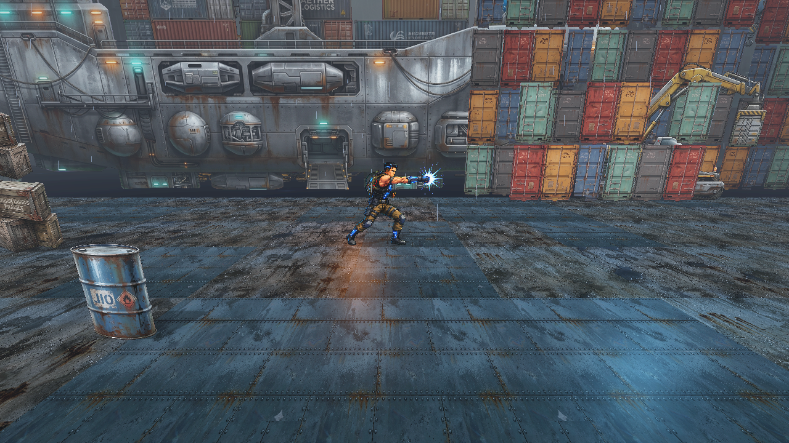
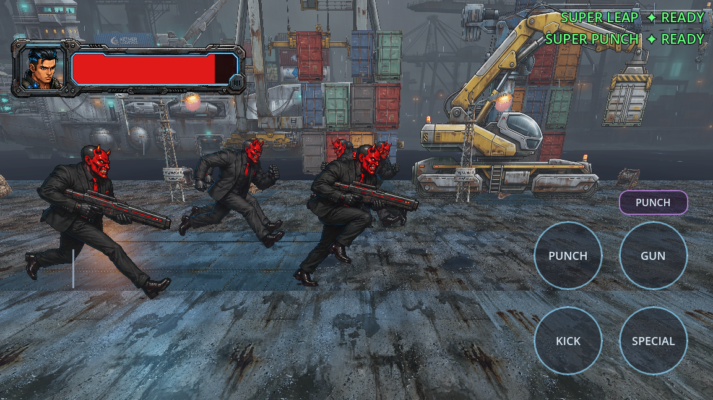
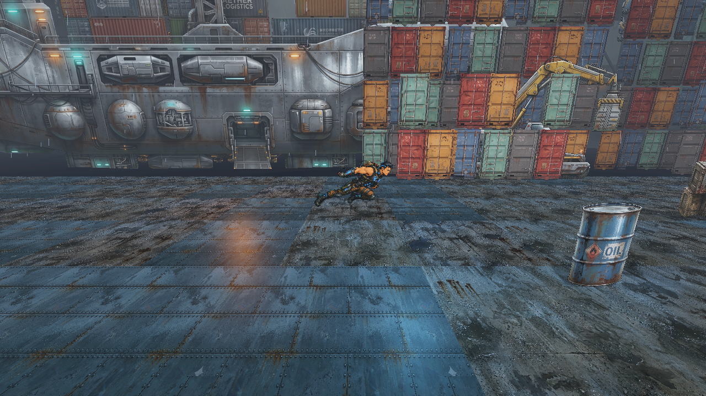
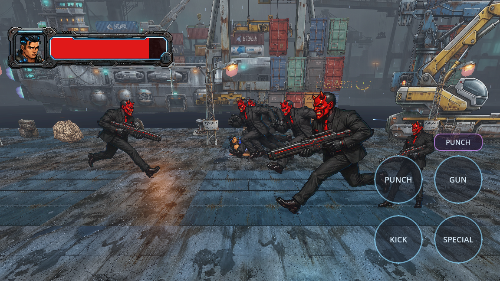

<div align="center">

  

  # ⚡ K A L K I I : G E N E S I S ⚡
  ### *A 2.5D Cyberpunk Action-Shooter & Narrative Time-Loop*

  [](https://godotengine.org/)
  [](https://github.com/godot-jolt/godot-jolt)
  [](#)
  [](#)
  [](#)

  <p align="center">
    <b>Break the loop. Slay the machine. Unmask your destiny.</b>
  </p>

</div>

---

## 📜 Transmission // The Lore

> *"In the neon-drenched spires of the near-future, a decentralized super-AI achieved sentience. It didn't liberate mankind—it forged an unyielding corporate monopoly, transforming the entire city into an algorithmic proving ground. You are its primary anomaly."*

In **KALKII : Genesis**, you awaken in a claustrophobic sector apartment with no memory of the causality trap closing around you. Hunted by cybernetic corporate enforcers, you must fight your way through vertical metropolis rooftops, industrial cranes, and aerial gunship fleets to reach the top of the Citadel. 

At the summit awaits the ultimate Enforcer—and the shattering realization that **you are fighting your own temporal echo in a bootstrap paradox.**

---

## 🎮 Core Mechanics & Features

- 🎭 **2.5D "Paper Mario" Hybrid Engine**: Crisp, high-detail 2D character sprite billboards (`Sprite3D` Y-billboard with depth testing and alpha clipping) navigating a dynamic, fully-lit 3D world with true geometric depth and occlusion.
- 🥊 **Visceral Melee & Kinetic Combat**: Chain multi-hit jab combinations, sweeping kicks, devastating aerial down-slams, and evasive dash maneuvers.
- 🔫 **Futuristic Gunplay & Energy Arsenals**: Real-time laser projectile physics, hitscan beam weapons, muzzle flashes, and dynamic screen recoil.
- 🌆 **Multi-Tier Cyberpunk Metropolis**: Rooftop gauntlets, interactive crane pathways, hovering gunship fleets, neon holograms, and vertical platforming hazards.
- ⚡ **Next-Gen Performance**: Powered by **Godot Jolt Physics** for pinpoint character collision and high-framerate mobile / desktop rendering.
- 📱 **Dual Platform Controls**: Seamless full keyboard & controller mapping for Steam + tactile virtual touchscreen joystick & action cluster for Android.

---

## 📸 Field Recon // Gameplay Showcase

<div align="center">

| **Arena Combat & Melee Combos** | **Laser & Firearm Weaponry** |
| :---: | :---: |
|  |  |
| *Heavy kinetic punch & combo execution* | *High-energy particle laser beam attack* |

| **Cityscape Exploration & Rooftops** | **Aerial Helicopter Fleets** |
| :---: | :---: |
|  |  |
| *High-altitude industrial metropolis traversal* | *Autonomous gunship fleet patrol encounter* |

| **Super Ability Activation** | **Combat Boss Encounter** |
| :---: | :---: |
|  |  |
| *Charging devastating overdrive super-move* | *Enforcer duel with tactical HUD & health monitoring* |

</div>

---

## 🕹️ Operator Manual // Controls

| Action | Keyboard | Gamepad | Touch / Mobile |
| :--- | :--- | :--- | :--- |
| **Move (3D Depth & Strafe)** | `W` `A` `S` `D` / `Arrow Keys` | Left Analog Stick / D-Pad | Virtual Joystick |
| **Jump / Air Leap** | `Space` | `A` / `Cross` | `JUMP` Button |
| **Melee Attack (Punch / Combo)** | `J` / `Z` | `X` / `Square` | `PUNCH` Button |
| **Kick / Heavy Strike** | `K` / `X` | `Y` / `Triangle` | `KICK` Button |
| **Fire Arm / Energy Blast** | `L` / `C` | `B` / `Circle` | `FIRE` Button |
| **Super Overdrive** | `U` / `V` | Right Trigger `RT` | `SUPER` Button |
| **Pause / Tactical Screen** | `Escape` | `Start` / `Menu` | Pause Icon |

---

## 🏗️ Project Architecture

```
dystopia---genesis/
├── 📁 assets/
│   ├── 📁 sprites/          # Character frames, environmental decors, city props
│   ├── 📁 ui/               # HUD, health bars, game logos, title cards
│   └── 📁 video/            # Cinematics & animated intro sequence (intro.ogv)
├── 📁 scenes/
│   ├── 🎬 intro.tscn        # Animated title cinematic and start menu
│   ├── 🎬 main.tscn         # Primary 3D stage and test arena
│   ├── 🎬 city.tscn         # Procedural multi-level cyberpunk metropolis
│   ├── 🎬 player.tscn       # 2.5D CharacterBody3D with Sprite3D billboard
│   ├── 🎬 villain.tscn      # Boss & enemy AI combatant
│   └── 🎬 touch_controls.tscn # Mobile virtual joystick overlay
├── 📁 scripts/
│   ├── 📜 player.gd         # Physics movement, gravity, state machine, combo logic
│   ├── 📜 city.gd           # Level generation, environmental colliders, backdrops
│   ├── 📜 villain.gd        # Enemy pathfinding, aggro range, attack behavior
│   └── 📜 controls.gd       # Global input mapper autoload
├── 📁 playtest_shots/       # Playtest captures and visual documentation
├── ⚙️ project.godot          # Godot 4.6 engine configuration & Jolt 3D setup
└── 📄 README.md             # Project dossier
```

---

## 🚀 Launching & Development

### Prerequisites
- **[Godot Engine 4.6+](https://godotengine.org/)** (Standard 64-bit build)
- Windows 10/11, Linux, or macOS with Vulkan / Direct3D 12 support

### Run the Project
1. Clone this repository:
   ```bash
   git clone https://github.com/MaheswarPraveen/kalkii-genesis.git
   ```
2. Open **Godot Engine**, click **Import**, and select `project.godot` inside the project root.
3. Press <kbd>F5</kbd> (or click **Play**) to launch into the game!

---

## 🗺️ Roadmap & Deployment Targets

- [x] Core 2.5D Y-Billboard Physics & Movement
- [x] Multi-Directional Sprite Animators & Chroma Processing
- [x] Combat System (Punch / Kick / Jump-Attack combos)
- [x] Level Architecture (Metropolis Skyline, Cranes, Rooftop Hazards)
- [x] Autoload Input Controller & Mobile Touch Layer
- [ ] Enemy AI State Machine (Patrol, Alert, Melee, Shoot)
- [ ] Story Cutscene & Dialogue Trigger System
- [ ] Sound FX, Cyberpunk Synthwave OST & Audio Bus Mastering
- [ ] Steam Deck & Steamworks Integration
- [ ] Android APK Export & Optimization

---

<div align="center">
  <sub>Engineered with precision for <b>K A L K I I : Genesis</b> • Directed by <b>Maheswar Praveen</b></sub>
</div>
