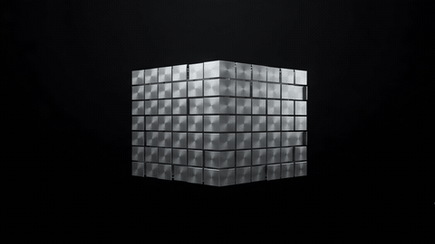

<div align="center">

  

  # KALKII : Genesis

  [](#)
  [](#license)
  [](https://godotengine.org/)
  [](https://github.com/godot-jolt/godot-jolt)
  [](#)

  <br/><br/>
  

</div>

---

## Overview

**KALKII : Genesis** is a story-driven 2.5D action shooter set in a dystopian cyberpunk metropolis. Developed under the studio banner **Quantum Pixels**, the game combines high-definition 2D sprite character animation with a full 3D environment—delivering responsive real-time combat, geometric depth, and dynamic lighting.

---

## Narrative

Set in the near future, the story follows a protagonist trapped in a temporal causal loop orchestrated by a sentient, monopolistic AI apparatus. Hunted through the industrial sectors of the city, the player must battle through corporate defense forces and ascend to the Citadel rooftop to confront the Enforcer, uncovering the paradox driving the city's timeline.

---

## Key Features

- **Hybrid 2.5D Presentation**: High-detail 2D character sprites rendered as upright Y-billboards within fully modeled 3D environments, ensuring natural perspective, shadow casting, and depth occlusion.
- **Integrated Combat System**: Fluid melee combinations, heavy strikes, air-to-ground recovery attacks, and ranged energy weapon integration.
- **Multi-Tier Level Design**: Vertically expansive city stages featuring rooftop navigation, industrial superstructure paths, and environmental hazards.
- **Optimized Physics Architecture**: Powered by Godot Jolt 3D for frame-accurate collisions and character mobility.
- **Cross-Platform Input**: Full support for standard desktop keybinds, game controllers, and dedicated on-screen touch controls for mobile.

---

## Controls

| Action | Keyboard | Gamepad | Mobile Touch |
| :--- | :--- | :--- | :--- |
| Movement | W / A / S / D or Arrows | Left Analog / D-Pad | Virtual Joystick |
| Jump | Space | A / Cross | Jump Button |
| Light Attack | J / Z | X / Square | Punch Button |
| Heavy Attack | K / X | Y / Triangle | Kick Button |
| Ranged Fire | L / C | B / Circle | Fire Button |
| Special Ability | U / V | Right Trigger | Special Button |
| Pause | Escape | Start / Menu | Pause |

---

## Technical Specifications

- **Game Engine**: Godot 4.6
- **Rendering Pipeline**: Mobile / Direct3D 12
- **Physics Engine**: Jolt 3D
- **Target Platforms**: PC (Windows, Linux / Steam Deck) and Android
- **Aspect Ratio**: 16:9 widescreen presentation

---

## Repository Structure

```
dystopia---genesis/
├── assets/
│   ├── sprites/          # Character animation sets, environment decors, props
│   ├── ui/               # Interface assets, studio intro animation, title branding
│   └── video/            # Cinematic sequences
├── scenes/
│   ├── intro.tscn        # Title sequence and main entry scene
│   ├── main.tscn         # Base gameplay arena
│   ├── city.tscn         # Sector metropolis stage
│   ├── player.tscn       # 2.5D player character controller
│   ├── villain.tscn      # Combatant enemy controller
│   └── touch_controls.tscn # Touch input overlay
├── scripts/
│   ├── player.gd         # Character state machine, physics, and combat logic
│   ├── city.gd           # Stage generation, bounds, and level logic
│   ├── villain.gd        # Enemy state logic and combat routines
│   └── controls.gd       # Global input mapper autoload
├── project.godot          # Engine project configuration
├── LICENSE               # Proprietary license agreement
└── README.md             # Project presentation
```

---

## License

Copyright © 2026 **Maheswar Praveen**  . All Rights Reserved.

This project, source code, and all associated artistic and audio assets are proprietary and confidential. No part of this software may be copied, modified, distributed, reverse-engineered, or used in any form without prior written authorization from the author.

---

<div align="center">
  <sub>KALKII : Genesis • Developed by <b>Maheswar Praveen</b> (Quantum Pixels)</sub>
</div>
